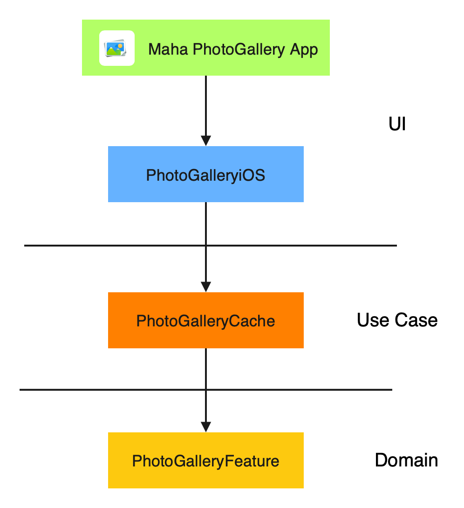
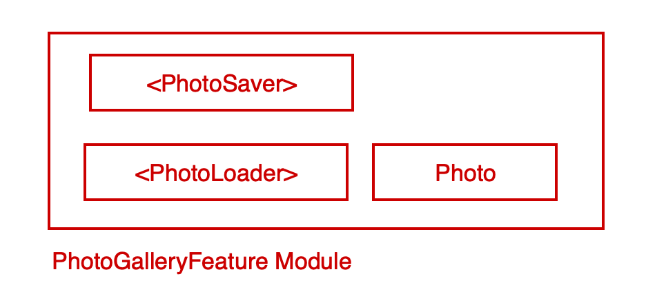
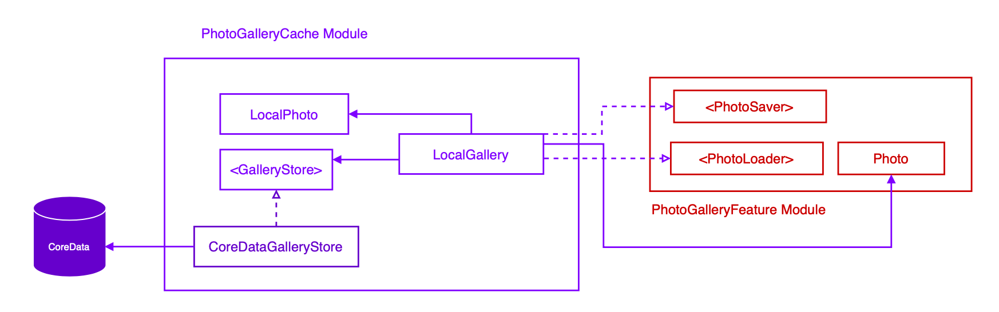
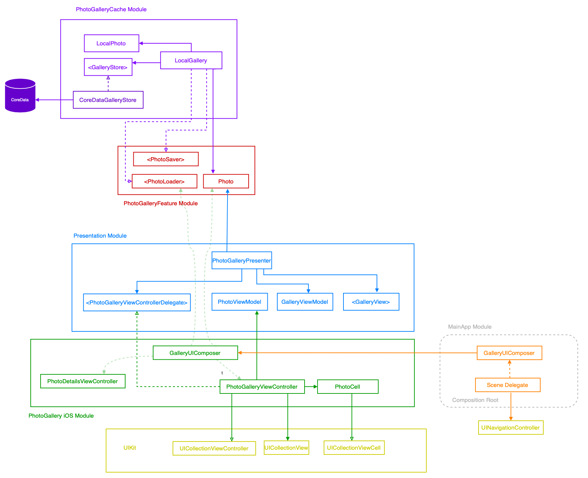
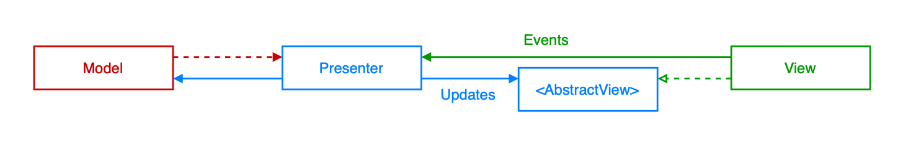
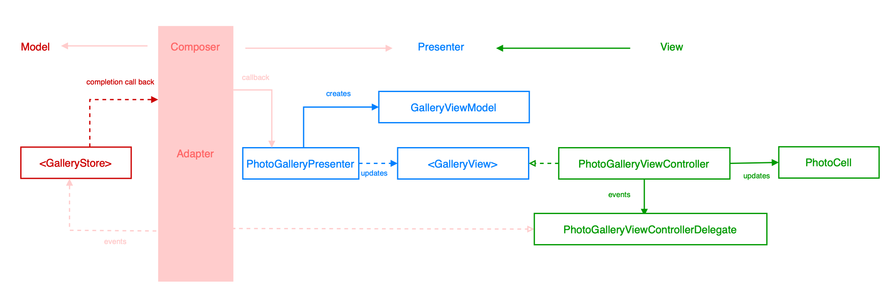

### Photo Gallery App

### Installation
Requires iOS 14.4 and Xcode 12.4 above.
Open `MahaPhotoGallery.xcworkspace` be sure `MainAPP` sheme is selected then run on your iOS device.
on the simulator has an issue photo name texfield will not respond, so you can not test the app properly.

### System Design Overview
This Project is developed based on modular design, a software design technique that emphasizes separating the functionality of a program into independent, interchangeable modules, such that each one contains everything necessary to execute only one aspect of the desired functionality

**Business reasons**
1. The company requires that parts of the codebase are reused and shared across projects, products, and teams
2. The company requires multiple products to be unified into a single one.

**Tech reasons**
1. It helps the teams to work in parallel without defining any bottlenecks and removes dependency
2. maintaining the code base becomes much easier as each module only contains the necessary code to run specific functionality
3. Increase development speed and independency and teams satisfaction
4. Each module can developed with with its own code style and presentation architectures
5. Enables port functionalities across projects/products and increases resuability.

#### Holistic Overveiw

##### Photo Gallery Feature
This module holds the foundation that our code is going to be built on. Saving and loading photos. It is a standalone feature, abstracted from soucre of photos and is independent of any platform or framework. 

##### Photo Gallery Cache
Use cases encapsulate business rules, and they are platform-agnostic and delivery-mechanism-agnostic. This module is independent of iOS frameworks and doesn’t care how response is presented to the user. This specific implementation of PhotoGalleryFeature Save and loads photos from cache.
`CoreDataGalleryStore` is core data implementation of GalleryStore, later we can replace it with FileSytem or any local cache whithout altering other modules. (Open-Closed principle). It doesnt have any platform specific implemnation and can be used on macos or watchos also 

This module is Fully tested

##### PhotoGalleryiOS
UI and iOS platform specific components resides here. This module doesn’t need an application, so we can use it across iOS apps! LocalGallery API implementations is injected and uses Unidirectional Data Flow (MVP+Adapters) to save and display photos.

#### MainApp
In this App module iOS specific with platform independent components composed by injecting dependencies to maintain loose coupling. In the composition root we have flexibility to plug or unplug features easily. Here we get composed PhotoGalleryViewController and set it as root view controller. 

### Architecture Overview
from below deigram dependency flow is from outside toward inside; from low level details (frameworks) to high level details (domain specifc logic). data pass through boundries via interfaces, so we can change outer modules without breaking implementations or being required to recompile unaffected modules. even reduces build time.

### Presentation Layer
**MVP Diagram**

In presentation layer we have used a variant of MVP pattern to have a clean separation between UI and Presentation logic. MVP is like MVC but instead of Controller there is a Presenter and dependency between View and Presenter is inverted by an AbstractView.

#### MVP with Adapter conforming to ViewDelegate

Another great MVP variation is to establish a unidirectional communication channel between the Presenter and the View through an Adapter. In this variation View doesn’t hold a direct reference to the Presenter and communication channel between View and Presenter is through an adapter. In this case, the Presenter doesn’t need to communicate with the domain services such as the <PhotoLoader>, making the Presenter much leaner as it will have no state management logic.
By moving the communication with Domain Services to Adapters, the Presenter now is a lean translation layer that just converts Domain values into presentable ViewModels.
The Adapter translates View events into service commands/requests and delegates responses and state transitions to the Presenter.

